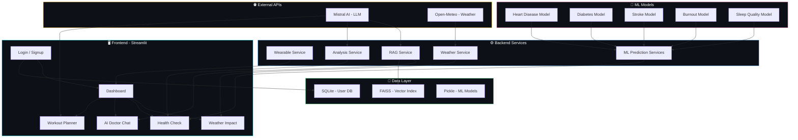

<p align="center">
  
</p>

<h1 align="center">🩺 AI Health Coach: A Mini Doctor in Your Pocket</h1>

<p align="center">
  <em>Smart health guidance, real-time monitoring, and personalized AI support — all in one app.</em>
</p>

<p align="center">
  
  
  
  
  
  
</p>

<p align="center">
  <a href="#-features">Features</a> •
  <a href="#%EF%B8%8F-architecture">Architecture</a> •
  <a href="#-tech-stack">Tech Stack</a> •
  <a href="#-getting-started">Getting Started</a> •
  <a href="#-project-structure">Project Structure</a> •
  <a href="#-ml-models">ML Models</a> •
  <a href="#-screenshots">Screenshots</a> •
  <a href="#-contributing">Contributing</a>
</p>

---

## 🌟 Features

### 📊 Real-Time Wellness Dashboard
> Live health metrics from wearable devices with interactive Plotly charts.
- ❤️ Heart Rate, Resting HR, HRV (RMSSD)
- 💤 Sleep Duration, Efficiency & Score
- 👟 Steps, Calories, Distance Tracking
- 🧬 SpO₂ & Stress Level Monitoring
- 📈 24-Hour Trends (Heart Rate & Steps)

### 🌦️ Weather-Based Health Impact
> Real-time weather data with personalized health advisories.
- 🌡️ Temperature, Humidity, UV Index, AQI
- 🌅 Sunrise & Sunset Times
- 📅 7-Day Weather Forecast
- ⚠️ Smart Health Alerts based on weather conditions

### 🏥 AI-Powered Health Checkup
> Predict health risks using trained ML models.
- 🫀 **Heart Disease** Prediction — Logistic Regression on UCI dataset
- 🩸 **Diabetes** Prediction — ML model on Pima Indians dataset
- 🧠 **Stroke** Prediction — Trained on healthcare stroke data
- 🔥 **Burnout Score** — Random Forest on wearable lifestyle data
- 😴 **Sleep Quality** — LightGBM root-cause explainer
- 📋 **Holistic Analysis** — Combined risk report via Mistral AI

### 💬 AI Doctor Chat
> RAG-powered conversational health assistant.
- 📚 Retrieval-Augmented Generation (RAG) with FAISS vector search
- 🤖 Mistral AI LLM for intelligent, contextual responses
- 📄 Knowledge base built from health/medical PDFs
- 💾 Persistent chat history within session

### 🏋️ AI Workout Planner
> Context-aware, personalized workout plans.
- Adapts to weather conditions & activity levels
- Considers health risks (heart, diabetes, stroke)
- Factors in burnout & sleep quality scores
- Real-time vitals integration (HRV, stress, HR)
- JSON-structured workout with safety notes

### 🛡️ Smart AI Agents
| Agent | Role | How It Works |
|-------|------|--------------|
| 🔍 **Observer Agent** | Proactive Health Monitoring | Continuously monitors vitals & weather for anomalies, triggers sidebar alerts |
| 📋 **Planner Agent** | Intelligent Workout Planning | Uses RAG + health risks + weather + vitals to generate safe, personalized plans |
| 🧪 **Analysis Agent** | Holistic Health Analysis | Combines all ML model outputs into a unified health report via LLM |

---

## 🏗️ Architecture



---

## 🛠️ Tech Stack

| Layer | Technology |
|-------|-----------|
| **Frontend** | Streamlit, Plotly, Custom CSS (Glassmorphism UI) |
| **LLM** | Mistral AI (`mistral-tiny`) |
| **ML Models** | Scikit-Learn, LightGBM, Random Forest, Logistic Regression |
| **RAG Pipeline** | Sentence-Transformers (`all-MiniLM-L6-v2`), FAISS, pdfplumber |
| **Weather API** | Open-Meteo (Free, no API key needed) |
| **Database** | SQLite (User auth & profiles) |
| **Auth** | bcrypt password hashing |
| **Backend API** | FastAPI + Uvicorn |

---

## 🚀 Getting Started

### Prerequisites
- Python 3.11 or higher
- A [Mistral AI API Key](https://console.mistral.ai/)

### 1️⃣ Clone the Repository
```bash
git clone https://github.com/YOUR_USERNAME/ai-health-coach.git
cd ai-health-coach
```

### 2️⃣ Install Dependencies
```bash
pip install -r requirements.txt
```

### 3️⃣ Configure API Keys

**Option A: Using `.env` file (Local Development)**
```bash
# Create a .env file in the root directory
echo MISTRAL_API_KEY=your_api_key_here > .env
```

**Option B: Using Streamlit Secrets (Cloud Deployment)**
```bash
mkdir .streamlit
echo 'MISTRAL_API_KEY = "your_api_key_here"' > .streamlit/secrets.toml
```

### 4️⃣ Build the RAG Knowledge Base *(Optional)*
Place health-related PDF files in a `rag/` folder, then run:
```bash
mkdir rag
# Add your health/medical PDFs to the rag/ folder
python build_rag.py
```
> **Note:** This step is optional. The app will work without it, but the AI Doctor chat will have limited knowledge.

### 5️⃣ Run the Application
```bash
python -m streamlit run app.py
```
The app will open at `http://localhost:8501` 🎉

---

## 📁 Project Structure

```
ai-health-coach/
│
├── 📄 app.py                    # Main Streamlit application (UI + logic)
├── 📄 build_rag.py              # RAG index builder (PDF → FAISS)
├── 📄 requirements.txt          # Python dependencies
├── 🖼️ bg_img.png                # Login page background image
├── 🗃️ users.db                  # SQLite user database
│
├── 📂 backend/
│   ├── 📄 database.py           # User auth (login, register, profile)
│   ├── 📄 main.py               # FastAPI backend server
│   │
│   ├── 📂 config/
│   │   └── 📄 defaults.py       # Default values for ML model inputs
│   │
│   ├── 📂 models/               # Pre-trained ML model files (.pkl)
│   │   ├── diabetes_model.pkl & diabetes_scaler.pkl
│   │   ├── heart_model.pkl & heart_scaler.pkl
│   │   ├── stroke_model.pkl & stroke_scaler.pkl
│   │   ├── invisible_burnout_random_forest.pkl
│   │   └── sleep_root_cause_lightgbm.pkl
│   │
│   ├── 📂 services/             # Core business logic
│   │   ├── ml_diabetes.py       # Diabetes prediction service
│   │   ├── ml_heart.py          # Heart disease prediction service
│   │   ├── ml_stroke.py         # Stroke prediction service
│   │   ├── ml_burnout.py        # Burnout score service
│   │   ├── ml_sleep.py          # Sleep quality service
│   │   ├── analysis_service.py  # Holistic health analysis (LLM)
│   │   ├── weather_service.py   # Open-Meteo weather integration
│   │   ├── weather_health_rules.py  # Weather-based health rules
│   │   ├── wearable_service.py  # Wearable device data simulation
│   │   └── lifestyle_rules.py   # Lifestyle recommendation rules
│   │
│   └── 📂 rag/
│       └── 📄 rag_service.py    # RAG search service (FAISS queries)
│
├── 📂 Dataset/                  # Training datasets
│   ├── diabetes.csv
│   ├── heart_disease_uci.csv
│   ├── healthcare-dataset-stroke-data.csv
│   └── wearables_health_6mo_daily.csv
│
└── 📂 ML_models/                # Jupyter notebooks (model training)
    ├── diabetes.ipynb
    ├── heart.ipynb
    ├── Stroke.ipynb
    ├── Feature_Engineering_ML.ipynb
    ├── Invisible Burnout Score.ipynb
    └── Sleep Root-Cause Explainer.ipynb
```

---

## 🧠 ML Models

| Model | Algorithm | Dataset | Purpose |
|-------|-----------|---------|---------|
| **Heart Disease** | Logistic Regression | UCI Heart Disease | Predicts risk of heart disease based on 13 clinical features |
| **Diabetes** | Classification Model | Pima Indians Diabetes | Predicts diabetes risk from glucose, BMI, insulin, etc. |
| **Stroke** | Classification Model | Healthcare Stroke Data | Predicts stroke risk from hypertension, heart disease, BMI |
| **Burnout Score** | Random Forest | Wearable Health (6 months) | Invisible burnout detection from daily activity patterns |
| **Sleep Quality** | LightGBM | Wearable Health (6 months) | Root-cause analysis of poor sleep quality |

### RAG Pipeline
```
PDF Documents → pdfplumber (Text Extraction)
    → 500-char Chunking
    → Sentence-Transformers (Embedding: all-MiniLM-L6-v2)
    → FAISS Index (Vector Storage)
    → Similarity Search → Mistral AI (Answer Generation)
```

---

## 📸 Screenshots

> 🚧 *Add screenshots of your app here after running it!*

| Dashboard | Weather Impact | Health Check |
|-----------|---------------|--------------|
| *Screenshot* | *Screenshot* | *Screenshot* |

| AI Doctor Chat | Workout Planner | Login Page |
|----------------|----------------|------------|
| *Screenshot* | *Screenshot* | *Screenshot* |

---

## 🌐 Deployment

### Streamlit Community Cloud
1. Push your code to GitHub
2. Go to [share.streamlit.io](https://share.streamlit.io)
3. Connect your GitHub repo
4. Set the main file as `app.py`
5. Add your `MISTRAL_API_KEY` in **Settings → Secrets**
6. Deploy! 🚀

---

## 🤝 Contributing

Contributions are welcome! Here's how:

1. **Fork** this repository
2. **Create** a feature branch: `git checkout -b feature/amazing-feature`
3. **Commit** your changes: `git commit -m 'Add amazing feature'`
4. **Push** to the branch: `git push origin feature/amazing-feature`
5. **Open** a Pull Request

---

## 📜 License

This project is open source and available under the [MIT License](LICENSE).

---

## 🙏 Acknowledgements

- [Streamlit](https://streamlit.io/) — Frontend framework
- [Mistral AI](https://mistral.ai/) — LLM provider
- [Open-Meteo](https://open-meteo.com/) — Free weather API
- [FAISS](https://github.com/facebookresearch/faiss) — Vector similarity search
- [Plotly](https://plotly.com/) — Interactive visualizations
- [UCI Machine Learning Repository](https://archive.ics.uci.edu/) — Heart disease dataset

---

<p align="center">
  Made with ❤️ for better health
</p>
